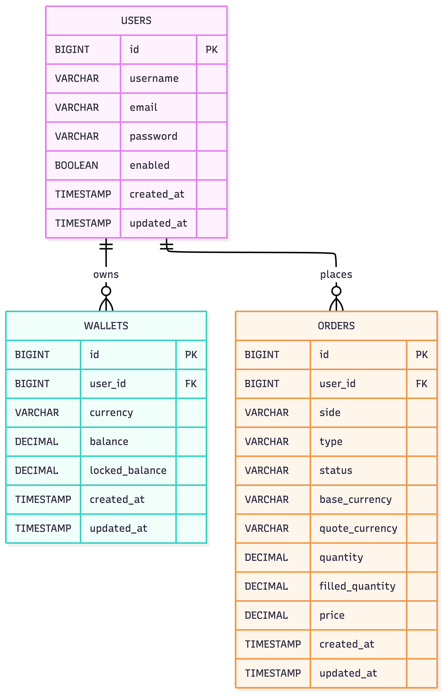
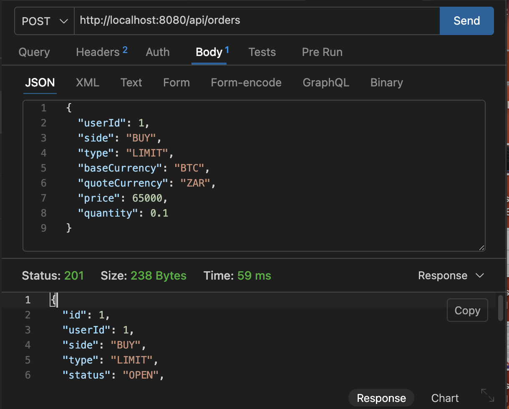
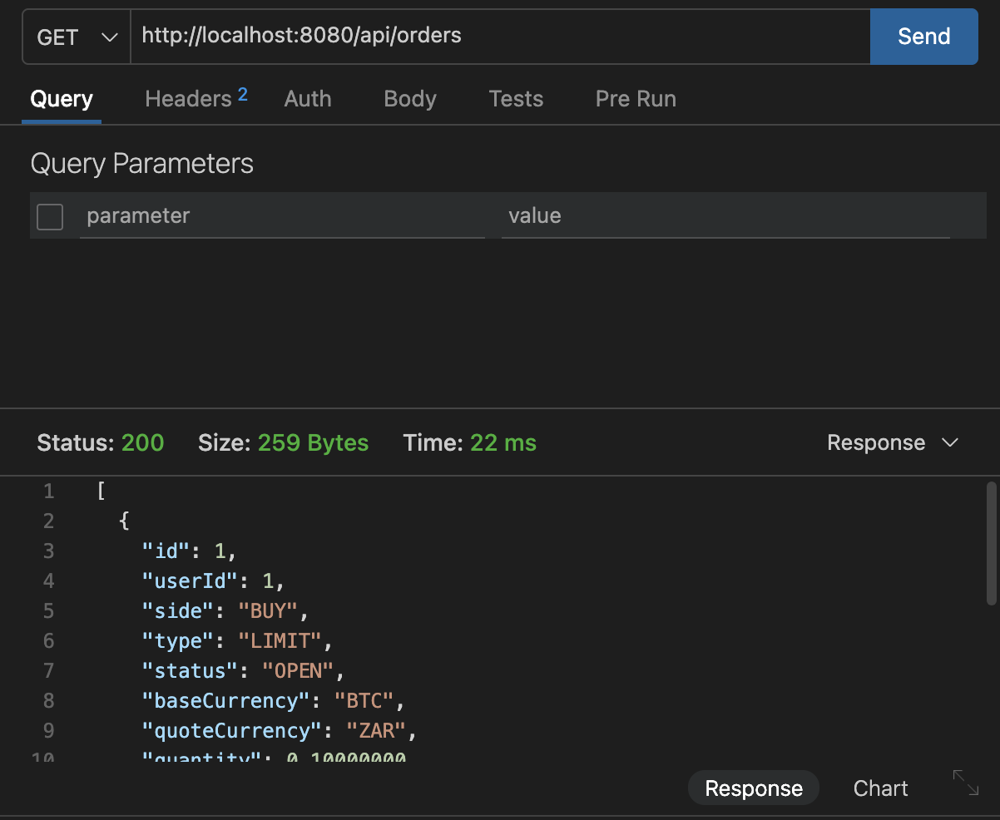
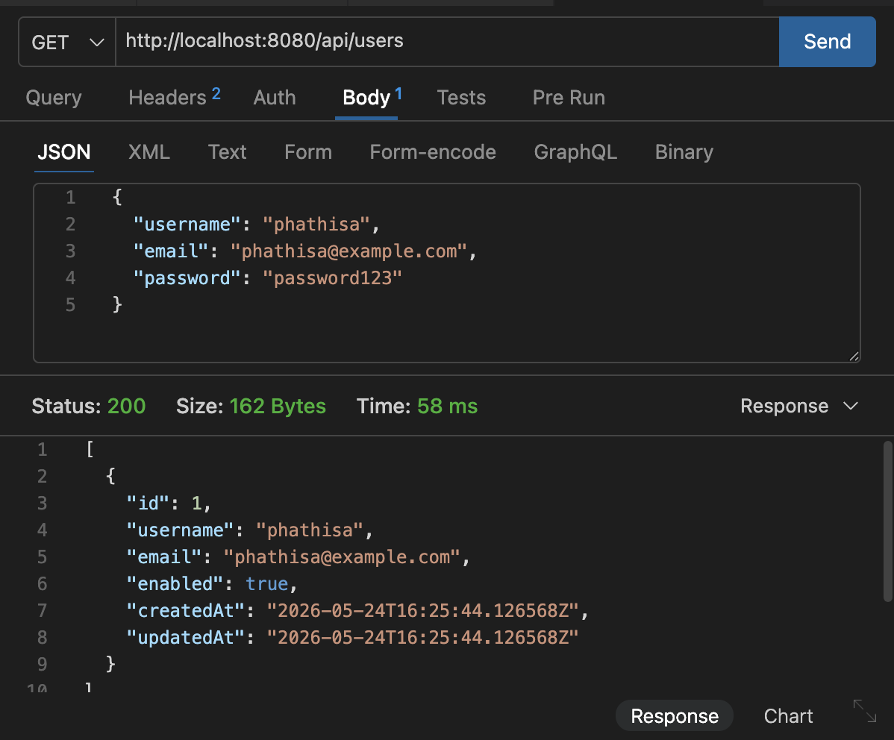
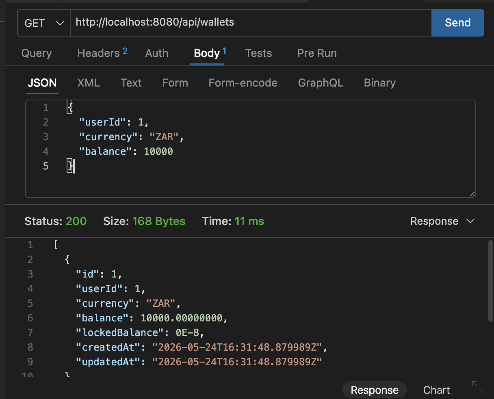

# Week 1 – Backend Foundations & API Design

[Back to Project Overview](../../README.md) | [Go to Week 2](../week-2/README.md)

## Objectives

- Establish the backend foundation for the OpenEx crypto exchange simulation
- Design the core domain model for users, wallets, and orders
- Build Spring Boot REST APIs with layered architecture
- Configure PostgreSQL persistence with JPA and Hibernate
- Prepare real-time communication support with Spring WebSocket
- Validate the backend through manual API testing and documentation artifacts

## Technologies Used

- Java 17
- Spring Boot
- Spring Data JPA
- PostgreSQL
- Hibernate
- Lombok
- Spring WebSocket
- Maven
- Thunder Client
- Redis cache support

## ER Diagram

The Week 1 entity relationship design is captured below:

Additional notes: [Week 1 ER Diagram Reference](../week1-er-diagram.md)

## Database Design

Week 1 centered on three primary entities:

- `User`
- `Wallet`
- `Order`

Key relationships:

- One user can own many wallets
- One user can place many orders
- Each wallet belongs to exactly one user
- Each order belongs to exactly one user

Primary design decisions:

- `BigDecimal` is used for balances, prices, and quantities
- Timestamps are managed for persistence events
- Order table naming avoids SQL keyword conflicts

## Spring Boot Setup

The backend is organized under `com.openex.backend` with the following packages:

- `controller`
- `service`
- `repository`
- `model`
- `dto`
- `config`

This structure keeps transport logic, business rules, persistence access, and domain modeling separate and easier to extend.

## REST API Endpoints

Week 1 introduced CRUD-oriented APIs for the core exchange modules.

### User APIs

- `GET /api/users`
- `GET /api/users/{id}`
- `POST /api/users`
- `PUT /api/users/{id}`
- `DELETE /api/users/{id}`

### Wallet APIs

- `GET /api/wallets`
- `GET /api/wallets/{id}`
- `POST /api/wallets`
- `PUT /api/wallets/{id}`
- `DELETE /api/wallets/{id}`

### Order APIs

- `GET /api/orders`
- `GET /api/orders/{id}`
- `POST /api/orders`
- `PUT /api/orders/{id}`
- `DELETE /api/orders/{id}`

## Repository Layer

Spring Data JPA repositories were created for the three core aggregates:

- `UserRepository`
- `WalletRepository`
- `OrderRepository`

These repositories support default CRUD operations plus practical lookup methods such as:

- user lookup by username and email
- wallet lookup by user and currency
- order lookup by user and status

## Entity Relationships

The persistence model is centered around account ownership:

- `User` has a one-to-many relationship with `Wallet`
- `User` has a one-to-many relationship with `Order`
- `Wallet` has a many-to-one relationship with `User`
- `Order` has a many-to-one relationship with `User`

This design keeps exchange balances and trading activity clearly tied back to an authenticated trader profile.

## PostgreSQL Configuration

The backend connects to PostgreSQL through Spring Boot datasource properties:

- URL: `jdbc:postgresql://localhost:5432/openex`
- Username: `postgres`
- Hibernate DDL mode: `update`

Week 1 verified that:

- the application boots against PostgreSQL
- JPA entities generate and update tables automatically
- seeded or created records persist through the repository layer

## Redis Configuration

Redis-backed caching is present in code and configuration, but it is optional at runtime:

- cache type defaults to `simple`
- Redis can be enabled with `OPENEX_CACHE_TYPE=redis`
- Redis host defaults to `localhost:6379`

This means the cache abstraction is implemented, while Redis-backed operation still depends on a running Redis instance in the local environment.

## API Testing Results

Week 1 APIs were verified manually through request testing and response inspection.

Verified outcomes:

- user listing returned persisted user records
- wallet listing returned seeded or created balances
- order listing returned persisted trade activity
- order creation requests reached the backend successfully

## Screenshots

### POST /api/orders

### GET /api/orders

### GET /api/users

### GET /api/wallets

## Challenges Faced

- Modeling exchange entities cleanly while keeping the first iteration simple
- Designing DTOs to avoid exposing internal entity details directly
- Avoiding overclaiming Redis completeness before runtime verification
- Setting up WebSocket infrastructure early without letting it distort the Week 1 core scope

## Learning Outcomes

- How to structure a Spring Boot backend using a clean layered architecture
- How entity relationships drive repository and service design
- How PostgreSQL and Hibernate accelerate backend iteration
- How DTOs, validation, and service rules improve API quality
- How to prepare a backend for real-time features before frontend integration begins

## Deliverables Achieved

- User, wallet, and order modules
- Spring Boot REST APIs
- PostgreSQL integration
- DTO-based API communication
- Validation and service-layer business logic
- WebSocket/STOMP infrastructure
- ER diagram and backend documentation

[Back to Project Overview](../../README.md) | [Continue to Week 2](../week-2/README.md)
