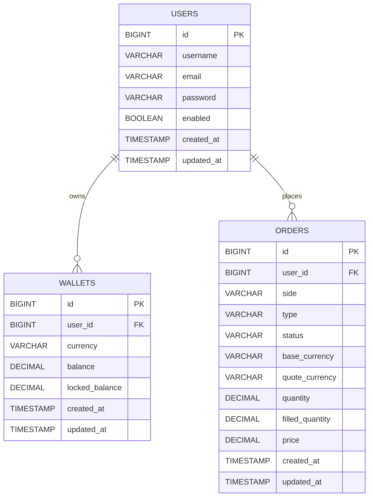

# OpenEx Week 1 ER Diagram

## Relationship Notes

- `users.id` is the primary key for `users`
- `wallets.user_id` is a foreign key to `users.id`
- `orders.user_id` is a foreign key to `users.id`
- One user can own many wallets
- One user can place many orders
